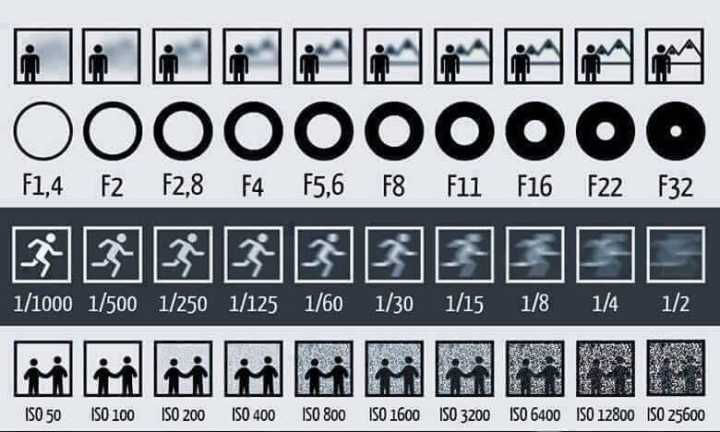

> 曝光是相机也是摄影里面非常重要的一个功能，复杂而且庞大，但还是有一些规律可循的

如果你用的M档（专业手动曝光档），那么这三个曝光三要素都是要手动来调节的。
针对每种情况可以遵循这样的规律：

- 过曝时调节顺序：ISO——S——F
> 过曝的时候，先看一下 ISO 是否最低，因为最低最好，不是就调到最低。然后看 S 是否很快了，甚至说是最快了。如果没有，就把 S 提高，可以保证瞬间的抓取不会虚等。如果你的 S 已经是 1/4000 了不能再快了，那就只能去调节F了。当然这样极端的情况很少见。
> 当然这只是一般的情况，特殊情况下是不按此规律的。比如闪光灯下、特效摄影（慢快门等）时除外，还有就是想要大景深需要把光圈开到 11 或更小的时候除外。
- 欠曝的时候调节顺序：F——S——ISO
> 欠曝的时候，先看一下 F 是否开到了最大，没有的话就直接开到最大。上面也说到了 F 开到最大基本上没有坏处（你要是定焦镜头除外啊哈啊）。F 没问题了就看 S 是否已经降到了手持可以承受的最低速度。比如你用一般的中间焦距的话，不低于 1/60 基本上没问题，如果你的快门速度是 1/500 这么快，当然可以降低一些了。好吧，现在你 F 和 S 都没有问题了（F 已经最大，S 已经最低），但是曝光还是欠（暗），这时候就是迫不得已要增高 ISO 的时候了。
> 当然这个也有特殊情况，比如要抓拍动态的时候、故意要增加噪点的时候等等。
> 上面的所有建议都是默认在 M 档的情况下。除了这些规律之外也可以使用半自动（也称为半专业档）档（AV、TV 档）。建议你想省事的话，可以使用A档，前提是把 ISO 最低，F最大，然后对准主体对焦拍摄，基本上主体的曝光就没有问题了。

- 光圈快门感光大小效果参考

  

- 参考

[快门速度、光圈&ISO值的搭配](https://www.zhihu.com/question/21798522) 